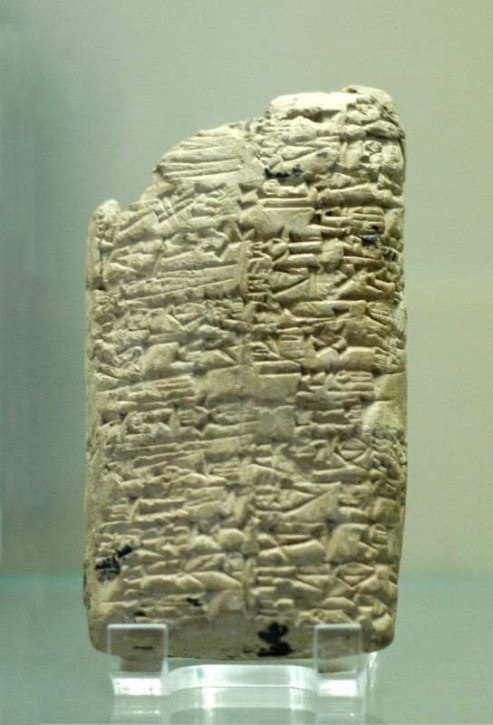
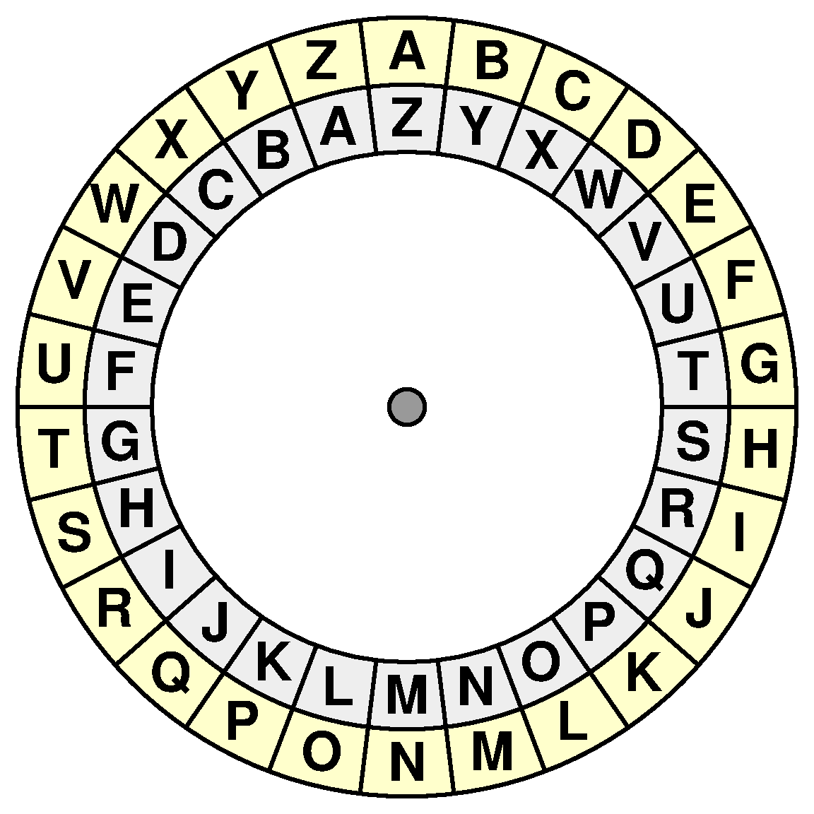
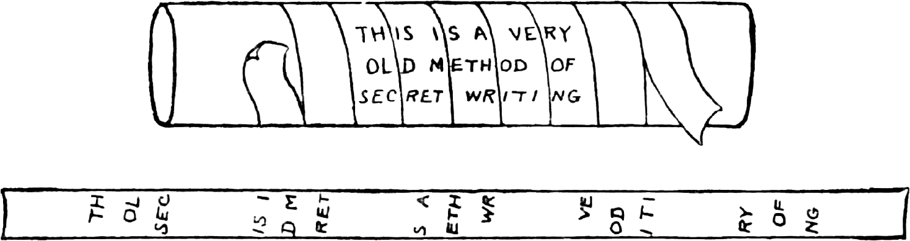
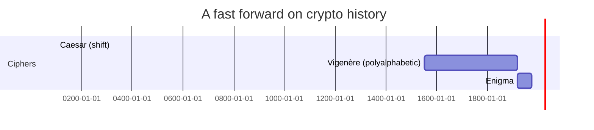

---
layout: cover
title: "Lecture 2: Cryptography"
subtitle: "Cryptographic ciphers, protocols, applications and attacks"
---

::default::

---

# This lecture

**Is not about:**

- **Steganography** — concealing a file/message/image/video within another
- **Obfuscation** — hiding program implementation without altering execution (Indistinguishability Obfuscation [9])
- **Cryptocoins** !!!

**Is about:**

- **Cryptography** — the science of writing a secret message
- **Cryptanalysis** — the science of breaking cryptography
- **Cryptology** — all of the above (actually, synonymous with cryptography)

---

# Vocabulary

- **Ciphertext** — result of encryption performed on **plaintext** using an algorithm, the **cipher**

```
c = encrypt(m, k)
```

- **Decryption** — the reverse process, obtain the original message

```
m = decrypt(c, k)
```

---
layout: section
---

# History

---
layout: two-cols
---

# Early encryption schemes

- **~1500 BCE** — clay tablets in Mesopotamia
- Hides a recipe of pottery glaze
- Used **substitution** as an encryption algorithm
- ...and the encryption was broken

::right::

<div class="flex flex-col items-center" style="text-align: center;">



<a style="font-style: italic; font-size: 9pt;"
	href="https://commons.wikimedia.org/wiki/File:Tablet_Rimush_Louvre_AO5476.jpg">Tablet (Rimush, Louvre AO 5476)</a>
</div>
<style>
.slidev-layout.two-columns {
	grid-template-columns: 65% 35%; 
    .col-right img { display: inline; max-width: 85% };
}
</style>

---
layout: two-cols
---

# Substitution

- E.g. **Atbash system**, used in the Bible [12]
- Jeremiah 25:26: *"And after all of them, the king of Sheshak will drink it too."*
  - In original Hebrew, the word **Sheshak** commutes into **"Babylon"**

::right::

<div class="flex flex-col items-center" style="text-align: center;">



<a style="font-style: italic; font-size: 9pt;"
	href="https://medium.com/@amangondaliya555/atbash-cipher-70e284ad921e">https://medium.com/@amangondaliya555/atbash-cipher-70e284ad921e
</a>
</div>

<style>
.slidev-layout.two-columns {
	grid-template-columns: 65% 35%;
    .col-right img { display: inline; max-width: 85% };
}
</style>

---

# Transposition

- Characters **change their position** in the text, but keep their original meaning
- E.g. encircles wood, called **scytales**, with paper (similar to the Rail Fence Cipher [13])

<div class="flex justify-center items-center h-ful">
<div style="margin-top: 2em; width: 70%">


[toebes.com — Flynns, 1924](https://toebes.com/Flynns/Flynns-19241213.htm)

</div>
</div>

---

# Fast forward on crypto history

- **Caesar cipher** (100 BCE – 44 BCE)
  - Shift cipher, e.g., k=4 → A→E, T→X …
  - Most of Caesar's enemies would have been illiterate ⇒ secure
- **Vigenère cipher** (1553 CE)
  - Poly-alphabetic substitution and transposition
- **1st & 2nd WW** → cipher machines:
  - **Enigma** for encryption
  - **Bombe** for decryption and cracking



---
layout: section
---

# Modern cryptography

---

# What does an ideal cipher look like?

- No correlation between **plaintext**, **key**, and **ciphertext**
- Cannot recover **key** from known plaintext + ciphertext
- **Confusion & Diffusion** !

> Do unbreakable algorithms exist?

<!--
Leave the question open — we'll revisit with One-time Pad and modern ciphers.
-->

---

# The XOR operator

Properties:

$$
A \oplus B = B \oplus A \qquad
A \oplus 0 = A \qquad
A \oplus A = 0
$$

$$
(B \oplus A) \oplus A = B \oplus 0 = B
$$

→ Apply XOR between message & key, apply with key again to **decrypt**!

---

# One-time Pad (Vernam, 1916)

- Protects against **infinitely powerful adversaries**
- XOR between a message and a **same-length secret**
- **Bad news:** if you want to encrypt N bits of data, you need an N-bit secret key

---

# Shannon's S-P network

- **Claude Shannon** — father of Information Theory (1949) [10]
- **Substitution** provides *'confusion'*
  - By building a complex binding between input and output
- **Permutation** (transposition) provides *'diffusion'*
  - By moving bits, one single bit influences all output bits
- Encryption algorithms / functions **MUST be invertible**

---

# Encryption schemes

---

# Two families

**● Symmetric:**

- Same key used for both encryption and decryption
- Two variants: **Block** and **Stream**

**● Asymmetric:**

- Different keys: **public** ≠ **private**
- New feature: **digital signatures**!

---

# Encryption ideologies

**Public algorithms** — all details are in the public domain, known to everyone.

- **Kerckhoffs' principle** (Dutch cryptographer): a cryptosystem should be secure even if everything about the system, **except the key**, is public knowledge.
- Reformulated as **Shannon's maxim**: *"the enemy knows the system"* — one ought to design systems under the assumption that the enemy will immediately gain full familiarity with them.

**Proprietary algorithms** — details known only to the designers and users.

- ...security through obscurity.

---


---
layout: section
---

# Symmetric ciphers

---

# Symmetric ciphers

- A symmetric cipher is built of:
  - A **'secret key'** (data exchanged 'in secret' by the two parties)
  - An encryption algorithm
  - A decryption algorithm
- The strength of a cipher is given by:
  - **Key size** (small keys can be exhaustively searched in a decent amount of time)
  - **Algorithm strength** (for example against statistical cryptanalysis)

---

# Stream ciphers

- **Keystream** — an 'infinite' stream of bits generated from a key
- Operations (remember One-Time Pad?):
  - `keystream ⊕ message → ciphertext`
  - `ciphertext ⊕ keystream → original message`
- The keystream must be **deterministic**, yet difficult to predict (without the key)
- Popular algorithms:
  - **RC4** (deprecated / broken)
  - **Salsa20 / ChaCha** (used by WireGuard)

---

# Block ciphers: DES (and 3DES)

- Developed by **IBM** as **LUCIFER**, modified by the **NSA**
- LUCIFER used a **128-bit** key — reduced to **56 bits** for DES ☺
- Adopted in **1977** as the **Data Encryption Standard** — DES
- Key length too small (56 bit) ⇒ **brute-force-able**

*Built on the **Feistel network**.*

---

# Block ciphers: AES

- January **1997**: NIST announced a competition for the successor to DES
- October **2000**: NIST selected **Rijndael** (pronounced "Rhine doll") by Belgian cryptographers **Joan Daemen** & **Vincent Rijmen**
- **2003**: AES approved for use with Secret and Top Secret classified information of the U.S. government

---

# Block ciphers modes

<v-clicks>

- Total data length ≫ block size! (e.g., **1 MByte** vs **128 bit**)
- How do we use one block cipher on a long message?

</v-clicks>

---

# Mode 1: Electronic Codebook (ECB)

- Each block encrypted **independently** ⇒ identical plaintexts encrypted similarly
- No chaining, no error propagation
- **Does not hide data patterns** — unsuitable for long messages!

---

# Mode 2: Cipher-Block Chaining (CBC)

- Chaining: ciphertext block cⱼ depends on xⱼ and all preceding plaintext blocks (dependency contained in cⱼ₋₁)
- Identical messages → different ciphertext
- Allows random access to ciphertext (decryption is still parallelizable)
- **Error propagation!**

---

# Mode 3: Cipher Feedback (CFB)

- Random access to ciphertext
- Decryption is parallelizable
- Identical messages: as in CBC
- Chaining: similar to CBC
- Error propagation ...

---

# Mode 4: Output Feedback (OFB)

- Preprocessing possible (keep enc/decrypting previous output block)
- No random access, not parallelizable
- Identical messages: same as CBC
- No chaining dependencies
- Error propagation: a single bit error on cⱼ may only affect the corresponding bit of xⱼ
- **IVs should not be reused!**

---

# Mode 5: Counter (CTR) / GCM

- Preprocessing possible
- Allows random access
- Both encryption & decryption are parallelizable
- Identical messages: changing the **nonce** results in different ciphertext
- No chaining dependencies, no error propagation
- **Nonce should be random**, and changed if a previously used key is reused

---

# Which mode for what task?

| Task | Mode |
| --- | --- |
| General file or packet encryption | **CBC** (input must be padded to a multiple of the cipher block size) |
| Resiliency / loss of ciphertext | **CFB** |
| Noisy line / no error propagation | **OFB** |
| High-speed data processing | **CTR / GCM** |
| Integrity check is required | **GCM** |

<!--
CBC requires padding to a multiple of the block size — common interview question.
-->

---
layout: section
---

# Asymmetric cryptography

---

# The problem

- **Symmetric key distribution** — how to do it securely?
- Can two parties agree on a **shared secret** without private communication?
  - [Ralph Merkle] (April 1975) *"Secure Communications Over Insecure Channel"*

---

# Diffie–Hellman (1976)

- One of the earliest **public-key protocols**
- Took Merkle's idea and improved it so the attacker requires **exponential computations**
- Establish a secret between 2 (possibly unacquainted) parties!
- **Security:** discrete logarithm problem (NP-complete)

---

# Diffie–Hellman — worked example

Common parameters: p = 5 (prime), g = 2 (primitive root)

| Step | Value |
| --- | --- |
| Alice's private key a = 4; public key → Bob: A = gᵃ mod p = 2⁴ mod 5 | **1** |
| Bob's private key b = 6; public key → Alice: B = gᵇ mod p = 2⁶ mod 5 | **4** |
| Alice computes: s = Bᵃ mod p = 4⁴ mod 5 | **1** |
| Bob computes: s = Aᵇ mod p = 1⁶ mod 5 | **1** |

**Same secret key — over a public channel.**

<!--
Walk through the example line by line; point out that p and g are public.
-->

---

# RSA (1977)

- **Ron Rivest, Adi Shamir, Leonard Adleman**
- **Key pair:**
  - Private key: p, q … ⇒ **decryption key**
  - Public key: n = p·q, e
- **Security:** factorization problem!
- **Primitives:**

```
c = encrypt(m, PubKey)
m = decrypt(c, PrivKey);

s = sign(m, PrivKey)
if (verify(s, PubKey)) ...
```

---

# The UK version

- **James H. Ellis** — idea of non-secret encryption in **1970** (5 years before Merkle)
- **Clifford Cocks** — equivalent of RSA in **1973** (3 years before RSA)
- **Malcolm J. Williamson** — equivalent of DH in **1974** (2 years before DH)

- [yep, no profit!]
- **GCHQ** decided to keep the discoveries secret till **1998**

---

# Elliptic Curve Cryptography

- Another approach to asymmetric encryption
- Elliptic curves in finite fields instead of finite Galois fields

- **Smaller numbers for equivalent security** (e.g., **384 vs 4096 bits**)
- Same domain parameters (e.g., p, a, b, G, n, h) ⇒ **standard curves** (e.g., NIST)!
- Algorithms: **ECDH**, **ECIES**, **ECDSA**, **EdDSA**, etc.

---
layout: section
---

# Hashing, integrity & attacks

---

# Message digest functions (hashing)

- **One-way functions** providing data 'summarization'
- Message **integrity**, **key derivation**
- Collisions exist but should be **hard to find**
- Popular algorithms:
  - **MD5** (broken): 1991, 128 bits
  - **SHA-1** family (1995): 160 bits
  - **SHA-2** family (2001), **SHA-3** (2010): 256–512 bits

---

# Practical integrity

- Hashing alone is not enough — an attacker can simply change both the message **and** the hash
- **MAC** (message authentication code) uses a **secret key** together with the function:
  - **HMAC** — function is hashing
  - **CBC-MAC** — function is CBC encryption mode
- **Asymmetric signature:** RSA, DSA, ECDSA, etc.

---

# Passive vs. active attacks

**Passive attacks**

- No communication with victim
- Stealing of private data without the victim knowing

**Active attacks**

- Involves changing data with the victim
- Unauthorized data access in order to modify / delete / alter it

---

# Types of attacks (1)

- **Ciphertext Only Attack (COA)** — attacker has ciphertext(s), not the plaintext; successful when the plaintext can be determined from the ciphertext
- **Known Plaintext Attack (KPA)** — attacker knows plaintext for parts of the ciphertext; task: decrypt the rest (typically by finding the key)
- **Chosen Plaintext Attack (CPA)** — attacker gets text of his choice encrypted; simplifies finding the encryption key
- **Chosen Ciphertext Attack (CCA)** — attacker obtains decryptions of chosen ciphertexts; can attempt to recover the decryption key

---

# Types of attacks (2)

- **Dictionary Attack** — attacker builds a dictionary of ciphertexts and corresponding plaintexts over time; later looks up the plaintext
- **Brute Force Attack (BFA)** — try all possible keys
- **Man in Middle Attack (MIM)** — targets public-key cryptosystems with key exchange before communication
- **Side Channel Attack (SCA)** — exploits weaknesses in the **physical implementation**
- **Timing/Power Analysis Attacks** — different computations take different times on a processor

---

# Practicality of attacks

- Often **highly academic**
- Weaker versions used (e.g., AES with fewer rounds)
- Unrealistic assumptions:
  - In chosen-ciphertext attacks, the attacker requires an impractical number of deliberately chosen plaintext–ciphertext pairs

---
layout: section
---

# Beyond classical crypto

---

# Post-quantum cryptography

- **GNFS** — fastest known (classical) algorithm to factor a prime on a binary processor (time depends on b bits)
- **Shor's algorithm** (Peter Shor) — computes a prime factorization on a **quantum computer**, much faster

→ Shor's algorithm breaks factorization-based crypto (RSA!). We need new assumptions.

---

# Homomorphic encryption

- Allows **computations on encrypted data**
- Not many operations are supported
- Mostly **addition and multiplication**
- In **2020**, there was a solution for **encrypted machine learning**

---

# Resources

- [1] [History of cryptography — Wikipedia](https://en.wikipedia.org/wiki/History_of_cryptography) · [11] [The Atlantic — history of encryption](https://www.theatlantic.com/technology/archive/2016/01/the-long-and-winding-history-of-encryption/423726/)
- [2] [Attacks on cryptosystems — TutorialsPoint](https://www.tutorialspoint.com/cryptography/attacks_on_cryptosystems.htm)
- [3] [Caesar cipher — Wikipedia](https://en.wikipedia.org/wiki/Caesar_cipher) · [12] [Atbash code](https://www.gotquestions.org/Atbash-code.html)
- [4] [DES history](http://www.umsl.edu/~siegelj/information_theory/projects/des.netau.net/des%20history.html)
- [5] [Modes of operation](http://www.utdallas.edu/~muratk/courses/crypto07_files/modes.pdf) · [6] [Modes of block ciphers](http://www.crypto-it.net/eng/theory/modes-of-block-ciphers.html)
- [7] [History of encryption — SANS](https://www.sans.org/reading-room/whitepapers/vpns/history-encryption-730) · [8] [Encryption research review](http://www.eng.utah.edu/~nmcdonal/Tutorials/EncryptionResearchReview.pdf)
- [9] *Indistinguishability Obfuscation from Well-Founded Assumptions* — Jain, Lin, Sahai
- [10] *Communication Theory of Secrecy Systems* — C. E. Shannon [PDF](https://www.cs.virginia.edu/~evans/greatworks/shannon1949.pdf)
- [13] [Transposition ciphers](http://cochranmath.pbworks.com/w/page/118045167/Transposition%20Ciphers)

---
layout: end
class: text-center
---

# Thank you

**Further reading:**
*Communication Theory of Secrecy Systems* — Claude E. Shannon (1949)

[cs.virginia.edu/~evans/greatworks/shannon1949.pdf](https://www.cs.virginia.edu/~evans/greatworks/shannon1949.pdf)
