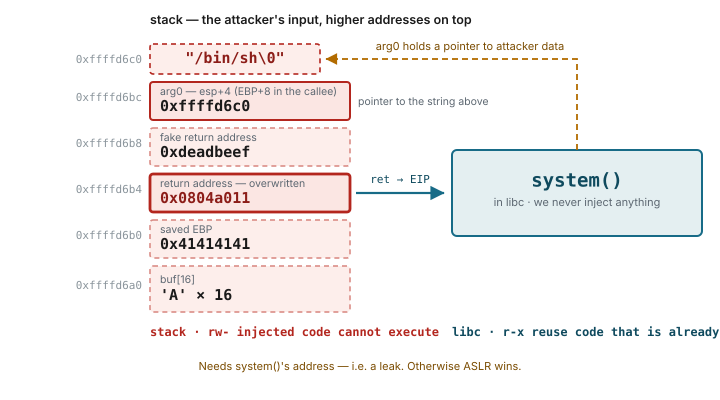
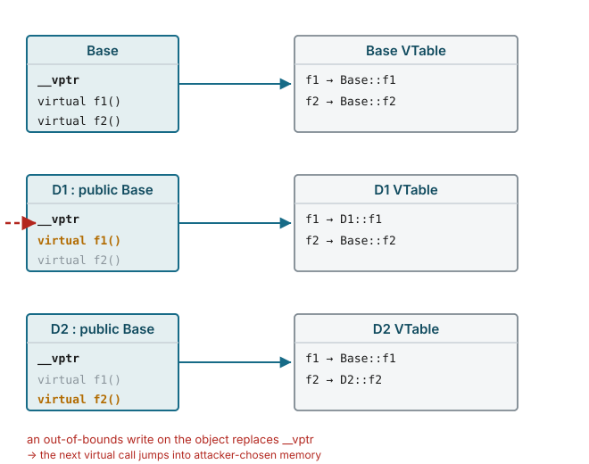

---
layout: cover
title: "Lecture 5: Application Security"
subtitle: "Software vulnerabilities, memory safety bugs, and defenses"
---

::default::

---
layout: quote
class: text-center
---

<br>
<br>
<br>

# Developer optimism

_'My software never has bugs. It just develops random features.'_

_'You're holding it wrong!'_

_'Only one more bug left'_

---

# Contents

<v-clicks>

1. Software Vulnerabilities. Cause & classification.
2. Memory safety: stack overflow
3. Defenses & Mitigations
4. More on attacks: Beyond the stack

</v-clicks>

---
layout: section
---

# Software vulnerabilities

---

# Software — the final frontier

- Access control and crypto are the bricks for building secure blocks
- Protocols/algorithms used to design useful blocks
- Software & hardware implement all of the above
- **Vulnerabilities** — flaws allowing unintended access in a system

---

# Properties of a vulnerability

- Target application / system component
- Cause
- Severity
- Effect: **Remote** vs **Local**, e.g.:
  - **Remote Code Execution (RCE)** — enter system via network
  - **Local Privilege Escalation** — become root!
- Discovery/exploitation timeline: previously disclosed vs **0-day**

---

# Vulnerability causes

<v-clicks>

- Broken authentication/authorization control / business logic bugs
- Cryptography Fails
- Misconfiguration
- Injection (i.e., script / commands / code)
- Input validation (e.g., format string, path traversal)
- Memory safety (buffer overflow, race condition, leaks, use after free etc.)
- UI confusion
- And many more!

</v-clicks>

---

# Real world examples

- **EternalBlue** — SMB protocol vulnerability (CVE-2017-0144)
  [research.checkpoint.com](https://research.checkpoint.com/2017/eternalblue-everything-know)
- **Microsoft Exchange RCE** (CVE-2021-26857)
  [microsoft.com](https://www.microsoft.com/security/blog/2021/03/02/hafnium-targeting-exchange-servers)
- **Flash Player** (CVE-2018-15982)
  [securityaffairs.co](https://securityaffairs.co/wordpress/78712/hacking/cve-2018-15982-flash-zero-day.html)
- **Log4Shell** (CVE-2021-44228)
  [blog.cloudflare.com](https://blog.cloudflare.com/inside-the-log4j2-vulnerability-cve-2021-44228/)

---
layout: two-cols
class: cols-40-60
---

# Memory safety

- Microsoft: **70% of all high severity security bugs are memory safety issues** [1]

[1] [zdnet.com (2019)](https://www.zdnet.com/article/microsoft-70-percent-of-all-security-bugs-are-memory-safety-issues/)
::right::

<div class="img-col">


*https://www.microsoft.com/en-us/msrc/blog/2019/07/a-proactive-approach-to-more-secure-code*

</div>

---
layout: section
---

# Memory safety: stack overflow

---
layout: two-cols
---

# Intro: address space

- Userspace processes use **virtual memory**
- Compiler (linker) / OS decide where each segment goes
- Address space layout has impact on application's security

::right::

<div class="img-col">

</div>

---
layout: two-cols
---

# The Stack

Stack holds function arguments, saved CPU state (saved program counter, previous frame, registers), and local variables:

```c
int f(int x) {
  char buf[10]; int n; // ...
}

int main() {
  f(x); // asm: call f() <-- saves PC
}
```

::right::

<div style="padding: 1em;">

</div>

---

# Intro: stack frame

The frame is not declared — it is built, one instruction at a time, by the x86 call convention:

<div class="cf-switch">

<v-switch transition="fade" :unmount="true">

<template #0>

</template>

<template #1>

</template>

<template #2>

</template>

<template #3>

</template>

<template #4>

</template>

<template #5>

</template>

<template #6>

</template>

</v-switch>

</div>

---
layout: two-cols
---

# Stack buffer overflow [2]

Happens when a buffer is written after its allocated size:

```c
char buf[16];
char *input = "AAAAAAAAAAAAAAAA<many times>";
strcpy(buf, input);
```

[https://security.cs.pub.ro/summer-school](https://security.cs.pub.ro/summer-school)

::right::

<div class="img-col">

</div>

---
layout: two-cols
class: cols-50-50
---

# Hijack using shellcode

When **input** can have sufficient size:

<div class="hj-code">

```c
void f(char *in) {
  char buf[16];
  strcpy(buf, in);  // no bounds check
  return;
}
```

</div>

<div v-click="2">

Note: `ret` is the one instruction that turns a data corruption into code execution:

<div class="hj-code">

```asm
    leave    ; esp = ebp ; pop ebp
    ret      ; eip = [esp]
```

</div>

_Spoilers: code injection won't work on a modern system (:_

</div>

::right::

<div class="hj-switch">

<v-switch transition="fade" unmount>
<template #0>

<p class="hj-cap">
  The input overwrites the stack frame: 16 bytes fill <code>buf</code>, 
  the next <code>8B</code> land on the saved <code>EBP</code> and replace
  <b>return address</b>, while the final part contains attacker-injected
  <b>machine code</b>.
</p>
</template>
<template #1>

<p class="hj-cap">
  The return address now says <code>0xffffd6a0</code> — an address
  <b>inside the buffer</b>, where the NOP sled and the shellcode sit.
</p>
</template>
<template #2>

<p class="hj-cap">
  <code>leave</code> brings <code>ESP</code> back to the frame, 
  <code>ret</code> pops our word into <code>EIP</code>:
  the CPU thinks it is a normal return and proceeds to execute 
  the injected code -> PROFIT!
</p>
</template>
<template #3>

<p class="hj-cap">
  The landing address does not have to be exact — 
  <code>0x90</code> is <code>nop</code>, so execution
  slides up into the payload.</p>
</template>
<template #4>

<p class="hj-cap">
  The stack is decoded as code and, for example, 
  <code>execve("/bin/sh")</code> runs.</p>
<p><b>Note: this needs an executable stack!</b></p>
</template>
</v-switch>

</div>

<style>
.slidev-layout .hj-switch img { display: block; width: 100%; max-height: none; }
.hj-switch { position: relative; padding-left: 1.4em; }
.hj-cap { margin-top: 0.4em; min-height: 3.2em; font-size: 0.85em; line-height: 1.35; color: #3f4b52; text-align: left; }
.hj-code { --slidev-code-font-size: 13px; --slidev-code-line-height: 1.4; }
</style>

---

# No-execute (NX) / DEP

- The page-table entry gets an **NX / XD bit**: the stack and the heap are no longer executable
- Policy **W ⊕ X** — a page is either writable or executable, never both
- The shellcode still lands on the stack; the CPU simply faults when `ret` jumps to it
- On by default for stack/heap on x86-64 (AMD NX / Intel XD) and arm64, off for code pages
- Weakness: just wait for it... (ret2libc, ROP)
- Careful: JIT compilers keep their code pages **RWX** (cf. JIT spraying)

---
layout: two-cols
class: cols-45-55
---

# Return to LibC

- Non-executable buffers? No problem!
- Reuse existing functions
- Example: jump to `execve()` / `system()` etc.
- Reminder: call args from `%EBP + 0x08`!

::right::

<div class="img-col">

</div>

---
layout: two-cols
class: cols-35-65
---

# Return oriented programming

- reuse **instructions** from exe/libs' code sections!
- defeats **NX**
- **Gadget**: short instruction sequence that ends in `ret`<br>
  (e.g. `pop rdi ; ret`)
- **Chain**: gadget addresses laid out on the stack<br>
  => each `ret` feeds the next gadget

::right::

<div class="img-col">

</div>

---

# Common ROP gadgets (x86-64)

| Gadget | What it buys the attacker |
|--------|---------------------------|
| `ret` | skip a slot: fix 16-byte alignment (the `movaps` crash) |
| `pop rdi ; ret` | 1st argument, e.g. `system("/bin/sh")` |
| `pop rsi ; ret` / `pop rdx ; ret` | 2nd / 3rd argument (`execve`, `write`) |
| `pop rax ; ret` + `syscall ; ret` | ret2syscall - no libc needed |
| `leave ; ret` | stack pivot: `RSP := RBP`, move the chain somewhere else |
| `add rsp, 0x?? ; ret` | jump over slots, dodge bad bytes |
| `mov [rdi], rax ; ret` | write-what-where → overwrite a GOT entry / function pointer |

- Finding them: `ropper`/`ROPgadget` / pwntools `ROP(...)`
- Nothing useful in the binary? Look in **libc** / **ret2csu** (`__libc_csu_init`)

<style>
table { font-size: 0.85em; }
table td, table th { padding: 0.3em 0.6em; }
</style>

---
layout: two-cols
---

# Generalization of memory exploits [7]

[7] SoK: Eternal War in Memory — [ieee-security.org](https://www.ieee-security.org/TC/SP2013/papers/4977a048.pdf)

<v-clicks>

1. Find vulnerable input buffer (e.g., stack / heap / data)
2. Find overwritable code pointer offset (e.g., saved EIP, VTable / GOT / function pointer)
3. Inject/reuse shell code (attacker-defined)
4. Corrupt code pointer with attacker value!
5. … **all your base are belong to us!** (CPU executes malicious instructions)

</v-clicks>

::right::

<div class="img-col">

</div>

---
layout: section
---

# Defenses & Mitigations

---
layout: two-cols
---

# Memory Attack Mitigations

- **DEP (data execution prevention) / No-execute (NX) bit**
  - defeated by ROP (return oriented programming)
- **Address space layout randomization**
  - defeated by memory leaks
- **Stack Canaries**
  - defeated by memory leaks, side channels, data overwrites
- **Shadow Stack**

::right::

<div class="img-col">

</div>


---
layout: two-cols
class: cols-45-55
---

# Address Space Layout Randomization (ASLR)

- Implemented by most OSes
- Requires programs be compiled as **Position-Independent Code**
- Segments can only be randomized at startup!
- **KASLR** — randomize kernel-space!

::right::

<div class="img-col">

</div>

---
layout: two-cols
---

# Stack Canaries

- Store random value before Saved EBP / Saved EIP
- Before returning from function, check this random value
- If modified, show error & exit
- Weaknesses:
  - memory leaks / side channels
  - canary guessing

::right::

<div class="img-col">

</div>

---
layout: two-cols
---

# Control Flow Integrity

```c
bool lt(int x, int y) {
  return x < y;
}

bool gt(int x, int y) {
  return x > y;
}

sort2(int a[], int b[], int len) {
  sort(a, len, lt);
  sort(b, len, gt);
}
```

::right::

<div class="img-col">

</div>

---

# Data integrity

- Easy: check bounds after each read/write of any variable!
- **SoftBound + CETS** — compile-time transformations enforcing spatial & temporal safety for C
  - Huge overhead!
- **Write Integrity Testing / Data Flow Integrity / Data Space Randomization**

---

# Protection mechanism summary

| Protection | Policy | Technique | Weakness | Perf. | Comp. |
|------------|--------|-----------|----------|-------|-------|
| Hijack | W⊕X | Page flags | JIT | 1x | good |
| Hijack | Return integrity | Stack cookies | Direct overwrite | 1x | good |
| Hijack | Address space rand. | ASLR | Info-leak. | 1.1x | good |
| Hijack | Control-flow integ. | CFI | Over-approx. | 1.4x | Libraries |
| Generic | Memory safety | SB+CETS | None | 2-4x | good |
| Generic | Data integrity | WIT | Over-approx. | 1.2x | Libraries |
| Generic | Data space rand. | DSR | Over-approx. | 1.3x | Libraries |
| Generic | Data-flow integrity | DFI | Over-approx. | 2-3x | Libraries |


---
layout: section
---

# Beyond the stack

---

# What about exploiting `.data`?

<div style="padding: 1em; font-size: 0.9em;">

```c
struct msg_funcs {
  void (*init)(struct message *msg);
  void (*print)(struct message *msg);
  void (*clear)(struct message *msg);
};

struct message {
  const struct msg_funcs *funcs;
  int len;
  char text[255];
};
```

</div>

::right::

<div style="padding: 1em; margin-top: 3em; font-size: 0.9em;">

```c
struct message all_messages[10]; // ...

int main() {
  // initialize modules…
  for (i = 0; i < n; i++) {
    struct message *msg = &all_messages[i];
    msg->funcs->init(msg);
    gets(msg->text);
  }
}
```

</div>

---
layout: two-cols
class: cols-45-55
---

# Object Oriented Security

- C++ (and other OOP languages) use **virtual method tables** (VTable) for polymorphism
- Attacker replaces VTable pointers with controlled memory
- When an object method is called, the function pointer is loaded from the attacker's VTable

::right::

<div class="img-col">

</div>

---
layout: two-cols
class: cols-40-60
---

# The Heap

- Dynamic memory allocation: `malloc` / `new`
- GLibC: one master arena, multiple heaps, connected by linked lists
- Virtual memory allocated by OS (`mmap` or `sbrk`)
- `malloc()` → returns a free chunk of contiguous memory, fills metadata
- `free()` → clears/resets chunk + metadata

[Source: GLibC Malloc Internals](https://sourceware.org/glibc/wiki/MallocInternals)

::right::

<div class="img-col">

</div>

---
layout: two-cols
---

# Dangling Pointer

- Return/store a pointer to an object that will become invalid after a while (e.g., after `free`)
- The pointer still points to valid memory!
- Example: returning stack-local pointers (frame becomes invalid after return)
- Dangerous, especially in OOP languages (e.g., C++) → attacker can override objects' VTable!

::right::

<div style="padding: 1em; font-size: 0.9em; margin-top: 2em;">

```c
char *parse_name(char *input) {
  char buf[100]; // process username
  return buf;
}

int main(...) {
  char *name = parse_name(argv[1]);
  process_more_data(argv[2]);
  if (strcmp(name, "admin") == 0)
    printf("Welcome master!\n");
}
```

</div>

---

# Use After Free

- Free the memory of an object (not needed anymore)
- Next, application allocates a new object with **attacker-controlled data**
- Another section of the application uses the released object (still has an old pointer stored in a variable)
- Are scripting languages safe? Nope!

<div class="font-size: 0.9em;">

```js
// Adobe Flash exploit (ActionScript)
ps = PSDK.pSDK;
ps.release();
ms = new MediaResource("jack", 0x54336677, null);
try {
  ps.createDefaultContentFactory();
} catch (e:Error) {
}
```

</div>

*[infosecwriteups.com/use-after-free](https://infosecwriteups.com/use-after-free-13544be5a921)*

---

# Size checks vs integer overflows

```c
#define HEADER_SIZE 128
uint16_t payload_len = user_payload_size();
uint8_t *buffer = malloc((uint16_t)(payload_len + HEADER_SIZE));
// user gives a valid payload len: 65534
// 65534 + 128 overflows!
// => malloc allocates just 126 bytes...

read_input_into_buffer(buffer, payload_len);
```

---

# Format string attacks

- `printf("x=%d, y=%d, z=%d", x, y, z)`
- What if the user controls the format string? `printf(user_input)`
- `"%s"` — read string from an address argument
- `"%X %X %X …"` — print args as hex
- Read-only vulnerability? Nope …
- `"%n"` — consume next argument as address (pointer) and store the number of bytes written so far into it

[exploit-db.com format string exploitation](https://www.exploit-db.com/docs/english/28476-linux-format-string-exploitation.pdf)

---

# Just in Time + scripting → bytecode injection!

- Defeats W ⊕ X
- **JIT Spraying**:

```
VAL = (VAL + 0xA8909090)|0;
VAL = (VAL + 0xA8909090)|0;
// => just in time compiles it into:
00: 05909090A8    ADD EAX, 0xA8909090
05: 05909090A8    ADD EAX, 0xA8909090
// offset pointer with +1 byte:
03: 90            NOP
04: A805          TEST AL, 05
```

---

# Data oriented attacks

- Memory overflows … non-control flow exploit?
- Defeats W ⊕ X, stack canaries, CFI etc. (we don't alter code execution!)
- **Data Oriented Programming Gadgets**
- Pointer write access → write to **ANY** program variable!

```c
int authenticated = 0;
struct user_info *user_ptr = auth_users[last_idx];
char username[100];
gets(username);
// meanwhile: check name & password
if (authenticated) {
  user_ptr->valid = 1;
  strcpy(user_ptr->name, username);
  last_idx++;
}
```

---
layout: two-cols
class: cols-45-55
---

# Drilling down into root causes

Microsoft (BlueHatIL 2019). Top root causes since 2016:

- **#1: heap out-of-bounds**
- **#2: use after free**
- **#3: type confusion**
- **#4: uninitialized use**

- Stack corruptions: essentially dead
- UAF: spiked 2013–15, killed by MemGC
- Spatial safety is still #1: heap OOB reads


::right::

<div class="img-col">

</div>

---
layout: section
---

# Finishing thoughts

---

# Is zero-vulnerability software even possible?

Though a disputed claim, **qmail** [6]

- Mail Transfer Agent by Daniel J. Bernstein, 1995 (last version: 1.03, 1998)
- **Zero security vulnerabilities so far!** _in default configuration_
  - _In 2005, security researcher Georgi Guninski found an integer overflow in qmail_
- Security practices:
  - Keep It Simple, Stupid (KISS)
  - Unix Philosophy (modular development, each component KISS)
  - Separate functions into multiple unprivileged binaries
  - Don't parse! Pass uniform/binary messages between programs!
  - Write careful code, avoid libc (`gets`, `printf`, `malloc`/`free` etc.)!

[blog.acolyer.org](https://blog.acolyer.org/2018/01/17/some-thoughts-on-security-after-ten-years-of-qmail-1-0/)

---

# Memory safety defense?

- Scripting (Python, JS etc.) / Java / C#?
  - not if you need performance (e.g., games, system level stuff) …
- Rust / Golang / Zig (etc.)
  - still able to write 'unsafe' code (syscalls / hardware interfaces / optimizations)
- Stronger typing systems:
  - Pure-functional programming (e.g., Haskell)
  - ATS (write both code + mathematical proofs!) → HARDEST
- Backwards compatibility … no money to rewrite everything from scratch
- Use secure coding practices, static analysis tools etc.
- Hardware pointer/boundary checks (Intel MPX, ARM PAC)

---

# References

- [1] [Microsoft: 70% of security bugs are memory safety issues](https://www.zdnet.com/article/microsoft-70-percent-of-all-security-bugs-are-memory-safety-issues/)
- [2] [security-summer-school.github.io/binary](https://security-summer-school.github.io/binary/)
- [3] [Linux format string exploitation (PDF)](https://www.exploit-db.com/docs/english/28476-linux-format-string-exploitation.pdf)
- [4] [GLibC: Malloc Internals](https://sourceware.org/glibc/wiki/MallocInternals)
- [5] [Use After Free](https://infosecwriteups.com/use-after-free-13544be5a921)
- [6] [Thoughts on security after ten years of qmail 1.0](https://blog.acolyer.org/2018/01/17/some-thoughts-on-security-after-ten-years-of-qmail-1-0/)
- [7] [SoK: Eternal War in Memory (PDF)](https://www.ieee-security.org/TC/SP2013/papers/4977a048.pdf)
- [8] [toolsjewels.html](https://people.scs.carleton.ca/~paulv/toolsjewels.html)

---
layout: end
class: text-center
---

# Thank you

**Further reading:**
*Computer Security and the Internet: Tools and Jewels* — Paul C. van Oorschot (Springer, 2021)

[people.scs.carleton.ca/~paulv/toolsjewels.html](https://people.scs.carleton.ca/~paulv/toolsjewels.html)
